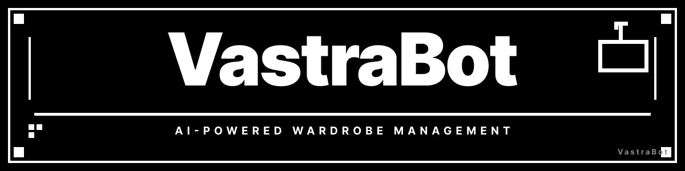

# VastraBot

[]()
[](https://deepmind.google/technologies/gemini/)
[]()

 

**VastraBot** is a high-performance, AI-orchestrated wardrobe management system. Powered by the cutting-edge **Gemini 3.0** engine and the **Nano Banana** framework, VastraBot acts as a private, self-hosted intelligent layer for your closet—turning a simple photo gallery into a dynamic, weather-aware style consultant.

---

## ✨ Key Features

- **📸 Gemini 3.0 Vision:** Send a photo; Gemini 3.0 instantly categorizes every detail, from material to season.
- **🖥️ Manual Management:** Use the powerful web frontend to manually organize your items, edit tags, and curate your personal collection.
- **🎭 Virtual Try-On:** See yourself in any outfit combination using state-of-the-art image generation.
- **🌤️ Weather-Aware Suggestions:** AI-generated recommendations tailored to live local weather data.
- **🤖 Nano Banana Orchestration:** High-speed job scheduling for daily outfit notifications via Telegram.

---

## 🏗️ Architecture

The project is built as a **transport-agnostic core**. This means the database, AI logic, and tools are decoupled from the interface.

```text
src/
├── ai/          # Gemini 3.0 & Nano Banana Integration
├── db/          # SQLite + Drizzle ORM (Schema & Queries)
├── jobs/        # Cron-based Job Scheduler (Daily Push Notifications)
├── tools/       # Core Business Logic (Wardrobe & Outfit Management)
└── transport/   # Interfaces
    ├── web/      # React + Vite + Tailwind (V4) Dashboard
    └── telegram/ # Grammy-powered Bot Interface
```

---

## 🚀 Quick Start

### 1. Prerequisites
- **Node.js 20+**
- **Gemini API Key** ([Get one for free here](https://aistudio.google.com/app/apikey))
- **Telegram Bot Token** ([From @BotFather](https://t.me/BotFather))

### 2. Installation
```bash
git clone https://github.com/your-username/closet.git
cd closet
npm install
```

### 3. Configuration
Copy the example environment file and fill in your keys:
```bash
cp .env.example .env
```
Key variables:
- `GEMINI_API_KEY`: Your Google AI Studio key.
- `TELEGRAM_BOT_TOKEN`: Your bot's token.
- `WEB_AUTH_PASSWORD`: A strong password to protect your web dashboard.

### 4. Password Recovery
Since VastraBot is self-hosted and privacy-focused, there is no "Forgot Password" email service. If you lose your password, you can reset it by deleting the stored setting directly from the database:

```bash
# Locate your database (defaults to ~/.closet/closet.db)
sqlite3 ~/.closet/closet.db "DELETE FROM settings WHERE key = 'password';"
```

After running this, restart the app. It will trigger the **First Run** setup, allowing you to create a new password.

### 5. Running the App
**Start the Web Dashboard (Dev):**
```bash
npm run web:dev
```
**Start the Telegram Bot:**
```bash
npm run telegram
```

---

## 📱 Interface Options

### Web Dashboard
A modern, neobrutalist interface built with **React**, **Vite**, and **Tailwind CSS**.
- **Closet:** Browse and filter your wardrobe by category or tag.
- **Outfits:** Create and save manual or AI-suggested combinations.
- **Try On:** Upload a reference photo and see how items look on you.
- **Settings:** Manage your location for weather lookups and change your password.

### Telegram Bot
Interact with your closet on the go:
- **Send a photo:** Adds an item instantly.
- `/outfit`: Get weather-based suggestions.
- `/tryon`: Start a virtual try-on session.
- `/weather`: Check current conditions.
- `/jobs`: Schedule daily morning outfit notifications.

---

## 🛠️ Tech Stack

| Component | Technology |
|---|---|
| **Core Engine** | Gemini 3.0 |
| **Orchestration** | Nano Banana |
| **Database** | Better-SQLite3 + Drizzle ORM |
| **Frontend** | React + Vite + Tailwind CSS v4 |
| **Backend** | Express.js |
| **Bot Framework** | GrammY |
| **Image Processing** | Sharp |

---

## 📜 License

MIT. This is a personal project—feel free to fork it, break it, and make it your own.
